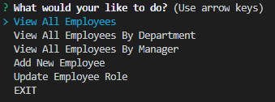

# Employee Tracker
## Description 

This application allows user to access data of its employee from Mysql database and run its query using node comand line environment.  In this application, user can view employee data in table format view, add new employee and update an employee's title.  

## Installation
### Steps required running the app:

In the terminal mode, user must first run __npm install__ to have its package dependecies. Then, user can run the __server.js__ file in Node environment by running __node server.js__. \
Then after sucessfull connection, a main menu of options will be displayed. \
 

## Usage 
### Main Menu: 
Using the up and down arrow key, user can choose which option they would like to run.
* Option 1: View All Employee \
This option will display all empoyees of the company.

* Option 2: View All Employee by Department.
This option allows user to choose a group of employee to be displayed by department category. \

* Option 3: View All Employee by Manager.
This option allows user to select a group of employee to be displayed based on the manager's name. \

* Option 4: Add a New Employee.
This option allows user to add a new employee with the name, the role and department. \

* Option 5: update an employee's role.
This option allows user to update en employee's title by changing the old title and assign a new title. \
Sample view before an update: \
 \
Sample view after an update: \

## MAINTAINER 
This is an individual assignment maintained by Carolina Yoedhana.
* GitHub repo: https://github.com/CarolinaYo/mysql-employeeTracker.git
